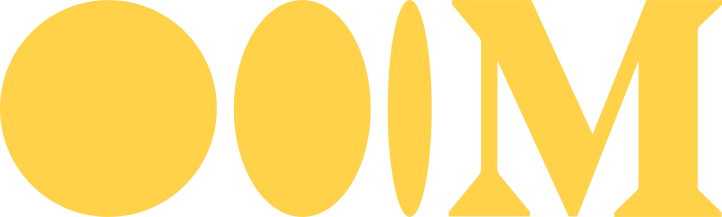

# Hi, I'm Razi Haider 

[][linkedin]

[][gmail]

[][dribbble]

[][medium]

 
 

 
   Visitor count:
   
    
 

### **I'm a Data Science and Machine Learning enthusiast!**

Hi! My name is Razi Haider and I'm a Full Stack Developer. I have completed BS in Computer Science at **Habib University**.

I've always been a person that if something fascinates me then 🔎 I'd find out how to do it, so programming has been a perfect fit for me. I love programming in all aspects but specially, my deep interest lies in data sceince. I love movies, games, books, rpgs and everything narrative. 

### **If you want to see some highlights of my production so far, check:**

- [Tabeer-e-Isharaat](https://github.com/razi-haider/Tabeer-e-Isharaat)
- [Seat Savers](https://github.com/razi-haider/Seat-Savers)
- [Serve Pakistan Foundation](https://github.com/razi-haider/Serve_Pakistan_Foundation_SPF)
- [Asteroids Point Zero](https://github.com/razi-haider/Asteroids-Point-Zero)
- [E-Shop Gaming Store](https://github.com/razi-haider/E-Shop-Gaming-Store)
- [Ghost Buster](https://github.com/razi-haider/Ghost_Busters)
- [Food Delivery Website](https://github.com/razi-haider/Foodoye)
- [Student Record Management System](https://github.com/razi-haider/Student-Record-Management-System)

### My Stack

#### Languages:

#### Application and Data:

#### UX/UI:

#### Utilities:

#### DevOps:

[linkedin]: https://www.linkedin.com/in/razi-h/
[gmail]: mailto:razi92695@gmail.com
[dribbble]: https://dribbble.com/razi-haider
[medium]: https://medium.com/@razi-haider
